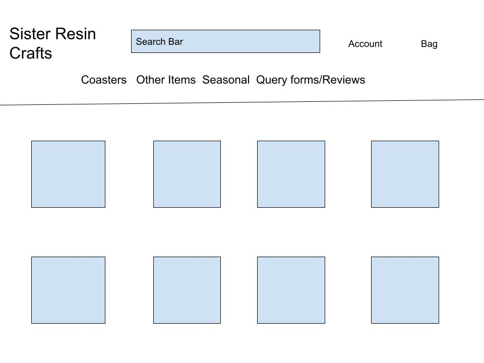

<h1 align="center">Sister Resin Craft</h1>

[View live project]()

"Sister Resin Crafts" -  4th  Milestone Project.

<h2>Screenshots:</h2>

# UX
The purpose of this site is to be an e-commerce web application with a fully functional payment system
and authentication system including email confirmations and user profiles. The superuser of the site will have the ability to create, edit and delete items. A registered user of the site will be able to browse the items and place them in a shopping bag and purchase them.
It is designed to be responsive for mobile, tablet and work on all modern browers.
The target audience for this site is for people who like something different from the normal, such as slasher coasters.

# User Stories
The goals of the business are:
1.  Increasing traffic from social media
2.  Creating more content
3.  Customer satisfaction
4.  Loyalty among customers
5.  Growing our online presence
6.  To have growth
7.  To have a good reputation for potential new customers

As a customer I want to:
1.   Learn the background of the company.
2.   For the site to be user friendly and easy to navigate
3.   View a list of products
4.   View details of each product
5.   Easy access to special offers
6.   To keep track on my spending
7.   To Register an account and easily log in and out
8.   To know the refund policy and the terms and conditions
9.   Recover my password
10.  Reviews and ratings from other customers to be easy to locate
11.  To recieve email conformation after registration and after an order
12.  Search for an item
13.  Not to have annoying pop ups
14.  Easy to purchase Items
15.  Easy navigation to Social Media links

As a returning customer I want:
1.  To see the website has been updated and what new items are available
2.  To easily find any promotional offers available including sales.
3.  To be able to contact company directly with any queries or customer order

# Design

## Framework

## Colour Scheme

## Typography

## Icons

## Wireframes

Coasters/Other items/Seasonal page: 

Home page:

## Features

# Technologies Used
Django

## Front-End

## Back-End

## Libraries

## Testing

### HTML validator
[W3C Markup Validator](https://validator.w3.org/)

### CSS validator
[W3C Markup Validator](https://jigsaw.w3.org/css-validator

### PEP8 validator
[W3C Markup Validator](https://www.pythonchecker.com/)

# Compatibility and Responsiveness

# Bugs

# Deployment

# Credits

