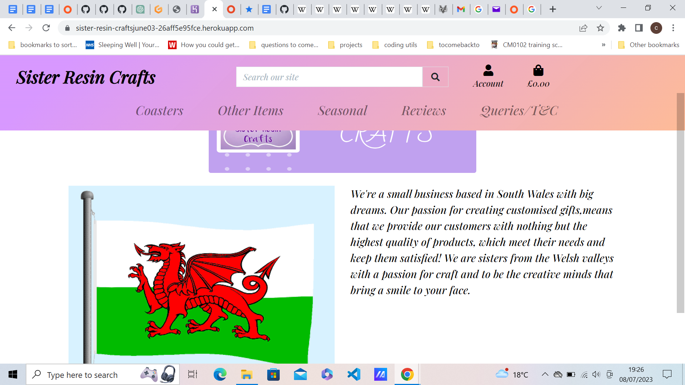

<h1 align="center">Sister Resin Crafts</h1>

[View live project](https://sister-resin-craftsjune03-26aff5e95fce.herokuapp.com/)

"Sister Resin Crafts" -  4th  Milestone Project.

<h2>Screenshots:</h2>

# UX
The purpose of this site is to be an e-commerce web application with a fully functional payment system and authentication system, including email confirmations and user profiles. The superuser of the site will have the ability to create, edit, and delete items and ratings. A registered user of the site will be able to browse the items, place them in a shopping bag, and make purchases.

The site is designed to be responsive for mobile and tablet devices and compatible with all modern browsers.

The target audience for this site is people who appreciate something different from the norm, such as slasher coasters.

# User Stories
The goals of the business are:
1.  Increasing traffic from social media
2.  Creating more content
3.  Customer satisfaction
4.  Loyalty among customers
5.  Growing our online presence
6.  To have growth
7.  To have a good reputation for potential new customers

As a customer I want to:
1.   Learn the background of the company
2.   For the site to be user friendly and easy to navigate
3.   View a list of products
4.   View details of each product
5.   Easy access to special offers
6.   To keep track on my spending
7.   To Register an account and easily log in and out
8.   To know the refund policy and the terms and conditions
9.   Recover my password
10.  Reviews and ratings from other customers to be easy to locate
11.  To recieve email conformation after registration and after an order
12.  Search for an item
13.  Not to have annoying pop ups
14.  Easy to purchase Items
15.  Easy navigation to Social Media links

As a returning customer I want:
1.  To see the website has been updated and what new items are available
2.  To easily find any promotional offers available including sales
3.  To be able to contact company directly with any queries or customer order

# Design
The goal was to create a e-commerce website that is overall user friendly and easy to navigate.
Here are my design choices:

## Framework
I chose Bootstrap for the front-end framework for this project. JQuery was used for initializing some elements.

## Colour Scheme
The main colour scheme of the site is a light purple, orange effect.

## Typography
The font used is Playfair Display, serif

## Icons
I used FontAwesome as the main icon library across the project

## Wireframes

Coasters/Other items/Seasonal page: 

Home page:

## Features

# Technologies Used
Django
allauth==0.41.0 
Pillow
Crispy Forms
Stripe
django-countries
gunicorn

## Front-End
HTML
CSS 
Javascript

## Back-End
Python 3.8.2 
Django
Heroku 
AWS

## Libraries
Bootstrap 4.4.1  - for front front-end framework. FontAwesome - to provide icons used across the project.

## Testing

### User Stories

The business aims to achieve the following objectives:

1. Increase social media-driven traffic:

The footer of the website contains links to various social media platforms, including Etsy and Instagram. In the future, these platforms will also feature links directing users to our website.

2. Generate more content:

As a superuser, you possess the ability to utilize CRUD functionality to manage products and reviews, allowing for the creation of engaging and informative content.

3. Enhance customer satisfaction:

While browsing the site does not require registration, registered users gain access to their purchase history and the ability to leave reviews, thereby fostering a sense of satisfaction and engagement.

4. Foster customer loyalty:

Through the user-friendly nature of the site and its potential for offering additional products, customers will be incentivized to revisit the website, fostering loyalty and repeat business.

5. Expand online presence:

Future plans involve incorporating additional social media platforms and establishing interconnectedness with the website, expanding our online reach and visibility.

6. Achieve growth:

The website's growth will be fueled by increased customer traffic, regular updates, and the integration of more social media platforms.

7. Cultivate a positive reputation to attract new customers:

Ensuring the satisfaction of existing customers with both the products and the website is crucial for building a reputable brand image. A strong reputation will attract potential new customers and stimulate further growth.

As a customer, my expectations and requirements are as follows:

1. Access comprehensive company background information:

Detailed information about the company's background can be conveniently found on the homepage by clicking the "Sister Resin Crafts" link.

2. Seamless user experience and intuitive navigation:

The website ensures user-friendliness and easy navigation. On the homepage, links are provided in both the navbar and footer. On mobile devices, simply click on the menu icon (represented by three bars) to access the links.

3. Browse a well-organized product catalog:

The website offers a categorized product catalog comprising three sections: Coasters, Other Items, and Seasonal. Currently, the seasonal section is focused on Christmas but will be regularly updated in the future.

4. Obtain detailed product information:

By clicking on a product, you gain access to comprehensive details and specifications.

5. Easily find and take advantage of special offers:

Although no special offers are currently available, the website will be promptly updated once such offers are introduced.

6. Keep track of personal spending:

Registered users can conveniently view their previous purchases by clicking on "My Profile."

7. Effortlessly register and log in/out:

To register an account, simply click on "Account" and select "Register." Once registered, you will be automatically logged in. For subsequent logins, click on "Login" in the same section.

8. Understand the refund policy and terms and conditions:

The refund policy and terms and conditions can be accessed by clicking on the "Queries/T&C" link in the navbar.

9. Recover a forgotten password:

Password recovery functionality is currently not available but will be implemented in the future.

10. Easily locate reviews and ratings from other customers:

To leave a review, log in to your account, select the desired product, and submit your review on the product detail page. All customer reviews will be displayed on the reviews page.

11. Receive email confirmations after registration and placing an order:

While there may be server-related issues preventing email confirmations for registration, an email confirmation will be sent once you have successfully completed a purchase.

12. Perform item searches effortlessly:

To search for a specific item, simply enter the desired keyword(s) in the search bar.

13. void disruptive pop-ups:

The website ensures a pop-up-free browsing experience for smooth navigation.

14. Facilitate easy item purchases:

To purchase an item, select the relevant product and click on "Add to Bag." When finished shopping, proceed to the bag and click on "Secure Checkout" to enter your details and complete the order.

15. Conveniently access social media links:

Social media links are conveniently located in the footer for easy access and navigation.

As a returning customer, my expectations and desires are as follows:

1. Stay informed about website updates and new product offerings:

The website will be regularly updated to showcase new items as they become available.

2. Easily locate and take advantage of promotional offers, including sales:

Future plans include implementing promotional offers on the website, allowing you to conveniently access and benefit from special deals.

3. Have direct communication with the company for any queries or customer orders:

To contact the company directly, simply click on "Queries/T&C." At the bottom of the page, you will find a link to submit your queries, ensuring prompt and efficient communication with the company.

### HTML validator
[W3C Markup Validator](https://validator.w3.org/)
All screenshots for testing can be seen in the test folder
The html links failed due to jinja template.

### CSS validator
[W3C Markup Validator](https://jigsaw.w3.org/css-validator
Screenshots of the CSS files can be found in the CSS folder in tests

# Compatibility and Responsiveness

# Bugs

# Deployment

ElephantSQL
1. Log in to ElephantSQL.com to access your dashboard.
2. Click “Create New Instance”
3. Give your plan a Name (sister resin crafts)
4. Select the Tiny Turtle (Free) plan
5. Leave the Tags field blank
6. Select “Select Region” which is Europe-west2(London)
7. Then click “Review”
8. Check your details are correct and then click “Create instance”
9. Return to the ElephantSQL dashboard and click on the database instance name for this project
10. In the URL section, clicking the copy icon will copy the database URL to your clipboard.

Heroku 
1. Click New to create a new app
2. Give the app a name(sister-resin-crafts) and select the region closest to you(Europe). When    you’re done, click Create app to confirm.
3. Open the Settings tab
4. Add the config var DATABASE_URL, and for the value, copy in your database url from ElephantSQL

Gitpod
1. In the terminal, install dj_database_url and psycopg2:
    pip3 install dj_database_url==0.5.0 psycopg2
2. Update the requirements.txt file with the newly installed packages:
    pip freeze > requirements.txt
3. In the settings.py file, import dj_database_url underneath the import for os
    import os
    import dj_database_url
4. Scroll to the DATABASES section and update it to the following code, so that the original connection to sqlite3 is commented out and we connect to the new ElephantSQL database instead:
    # DATABASES = {
    #     'default': {
    #         'ENGINE': 'django.db.backends.sqlite3',
    #         'NAME': os.path.join(BASE_DIR, 'db.sqlite3'),
    #     }
    # }
     
    DATABASES = {
     'default': dj_database_url.parse('your-database-url-here')
    }

5. In the terminal, type python3 manage.py showmigrations
6. Migrate the database models to the new database using python3 manage.py migrate
7. Load in the fixtures, categories first.
    python3 manage.py loaddata categories
    python3 manage.py loaddata products
8. Create a superuser for your new database
    python3 manage.py createsuperuser
9. Delete database from settings.py and reconnect to the local sqlite database.
    DATABASES = {
     'default': {
         'ENGINE': 'django.db.backends.sqlite3',
         'NAME': os.path.join(BASE_DIR, 'db.sqlite3'),
     }
 }
 
 ElephantSQL

1. On the ElephantSQL page for the database, in the left side navigation, select “BROWSER”
2. Click the Table queries button, select auth_user(public)
3. When you click “Execute”, you should see your newly created superuser details displayed. This   confirms your tables have been created and you can add data to your database.

 Gitpod

1. In settings.py change this line to ACCOUNT_EMAIL_VERIFICATION = 'none'.
2. Change database in settings to an if statement:
    if 'DATABASE_URL' in os.environ:
    DATABASES = {
        'default': dj_database_url.parse(os.environ.get('DATABASE_URL'))
    }
else:
    DATABASES = {
        'default': {
            'ENGINE': 'django.db.backends.sqlite3',
            'NAME': os.path.join(BASE_DIR, 'db.sqlite3'),
        }
    }
3. Install gunicorn in the terminal : pip3 install gunicorn
4. pip freeze > requirements.txt
4. Create a Procfile o tell Heroku to create a web dyno.
    web: gunicorn sisterresincrafts.wsgi:application
5. Install Heroku in the terminal: npm i -g heroku

Heroku
1 . Scroll down to the API Key section, then click on the 'reveal' button, and copy the API Key.

Gitpod
1. Login into heroku : heroku login -i
2. Type in your email address, and when prompted for your password, right-click and select paste in  the API key.
3. Type 'heroku config:set DISABLE_COLLECTSTATIC=1 -a sister-resin-crafts' in the terminal.
4. Add the hostname of our Heroku app to allowed hosts in settings.py
    ALLOWED_HOSTS = ['sister-resin-crafts.herokuapp.com',
                '8000-mcnic16-sisterresincraf-dekxparl9be.ws-eu101.gitpod.io']
5. Type 'heroku git:remote -a sister-resin-crafts' in the terminal
6. git add, git commit, git push then git push heroku main

Heroku
1. On the deploy tab set it to connect to github.
2. Search for my repository (sister-resin-craftsjune03) and then click connect.
3. Enable automatic deploys.
4. Generate a random secret key number.
5. In the config vars add SECRET_KEY with the new number

GitPod
1. Change the following variables in settings:
    SECRET_KEY = os.environ.get('SECRET_KEY', '') 
    DEBUG = 'DEVELOPMENT' in os.environ

AWS amazon services
1. Search for s3, in s3 create a bucket.
2. Type in the name for the bucket (sister-resin-craftsjune03)
3. aws region = London
4. Enable ecl
5. untick Block all public access
6. Click on Create Bucket
7. click on bucket :sister-resin-craftsjune03
8. Go to properties  and click on static website hosting 
9. For the index and error document, we can just fill in some default values since they won't be used in this case and then click save.
10. On the permissions tab paste in a coors configuration:
    [
{
"AllowedHeaders": [
"Authorization"
],
"AllowedMethods": [
"GET"
],
"AllowedOrigins": [
"*"
],
"ExposeHeaders": []
}
]
11. The Bucket Policy is unchanged. For the Access control list (ACL) section, click edit and enable List for Everyone (public access) and accept the warning box. 
12. Click on Bucket Policy and Policy generator
13. Select Type of Policy - s3 bucket policy
14. Allow all principals by using *
15. For the action select get object
16. Copy the ARN which stands for Amazon resource name from the other tab and paste it into the     ARN box here at the bottom.
17. Click Add statement.
18. Click generate policy.
19. Copy this policy into the bucket policy editor.
20. Add a /* here onto the end of the resource key and click save.
21. Search for IAM
22. Click on create group
23. Type in the name of the user group.
24. Click on Create Policy
25. To attach the policy, on the sidebar click User Groups. Select your group, go to the permissions tab, open the Add permissions dropdown, and click Attach policies. Select the policy and click Add permissions at the bottom.
26. In IAM left sidebar click on users, then the username of the user you have just created
27. Below the user summary click on the tab security credentials
28. Scroll down to access keys and click create access key
29. Here you can create an access key and secret access key and once saved, download the csv file

Gitpod
1. install boto 3 and django storages
2. pip freeze > requirements.txt
3. Put the follow in settings.py:

if 'USE_AWS' in os.environ:
    # Bucket Config
    AWS_STORAGE_BUCKET_NAME = 'sister-resin-craftsjune03'
    AWS_S3_REGION_NAME = 'eu-west-2'
    AWS_ACCESS_KEY_ID = os.environ.get('AWS_ACCESS_KEY_ID')
    AWS_SECRET_ACCESS_KEY = os.environ.get('AWS_SECRET_ACCESS_KEY')
    AWS_S3_CUSTOM_DOMAIN = f'{AWS_STORAGE_BUCKET_NAME}.s3.amazonaws.com'

    # Static and media files
    STATICFILES_STORAGE = 'custom_storages.StaticStorage'
    STATICFILES_LOCATION = 'static'
    DEFAULT_FILE_STORAGE = 'custom_storages.MediaStorage'
    MEDIAFILES_LOCATION = 'media'

    # Override static and media URLs in production
    STATIC_URL = f'https://{AWS_S3_CUSTOM_DOMAIN}/{STATICFILES_LOCATION}/'
    MEDIA_URL = f'https://{AWS_S3_CUSTOM_DOMAIN}/{MEDIAFILES_LOCATION}/'

Heroku

1. Add: AWS_ACCESS_KEY_ID to the convig vars, and also AWS_SECRET_ACCESS_KEY with the variables in the csv file.
2. Add USE_AWS and set it to true.
3. remove the disable collectstatic variable.

gitpod

1. Add a newfile custom_storages.py
2. Add the following code:
from django.conf import settings
from storages.backends.s3boto3 import S3Boto3Storage

class StaticStorage(S3Boto3Storage):
    location = settings.STATICFILES_LOCATION

class MediaStorage(S3Boto3Storage):
    location = settings.MEDIAFILES_LOCATION

    

# Credits

